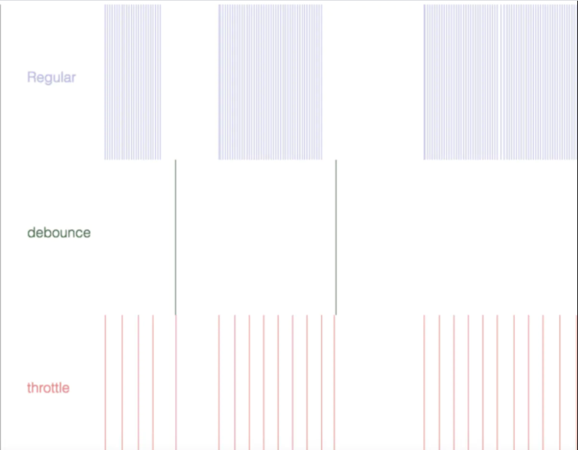

---
id:js0

title:函数的防抖跟节流

---

## 防抖跟节流的区别

### 函数防抖（debounce)

函数防抖，就是指触发事件后，在 n 秒后只能执行一次，如果在 n 秒内又触发了事件，则会重新计算函数的执行时间。

### 函数节流 (throttle)

限制一个函数在一定时间内只能执行一次。

这里用一张图片:



## 常见的应用场景

### 函数防抖(debounce)的应用场景

连续的事件，只需触发一次的回调场景有：

1. 搜索框输入搜索,用户输入停止
1. 手机号,邮箱验证
1. 窗口size大小的改变，只需窗口调整完成后，计算窗口的大小，防止重复渲染。

### 函数节流(throttle)的应用场景

1. 滚动加载,加载更多
1. 高频触发事件(例如移动、频繁点击事件)

## 常见的库

1. `rxjs`是一个库，用于通过使用可观察的序列来组成异步和基于事件的程序 --[rxjs](https://rxjs-dev.firebaseapp.com/)
2. `Lodash`是一个一致性、模块化、高性能的 JavaScript 实用工具库。 --[Lodash](https://www.lodashjs.com/)

## 实现原理

### debounce

```ts

function debounce(func: Function, wait: number): Function {
    let timer: any = null;
    return (...args: any[]) => {
        if (timer) clearTimeout(timer)
        //每次事件触发的时候会清空上次的事件
        timer = setTimeout(() => {
            func.apply(this, args)//为了绑定正确的this
            timer = null
        }, wait)
    }
}
```

### throttle

#### 时间戳版

```ts
function throttle(func: Function, wait: number): Function {
    let prev = Data.now() - wait; //上一次的触发的时间
    return (...agrs: any[]) => {
        if (Data.now() - prev >= wait) {  //如果这一次的时间时间间隔大于等于设置的时间触发函数
            func.apply(this, agrs)
            prev = Date.now();  //初始化上一次的触发为本次事件时间
        }
    }
}

```

#### 定时器版

```ts
function throttle(func: Function, wait: number): Function {
    let timer: any = null;
    return (...ages: any[]) => {
        if (!timer) {
            timer = setTimeout(() => {
                func.apply(this, ages)
                timer = null;
            }, wait)
        }
    }
}
```


