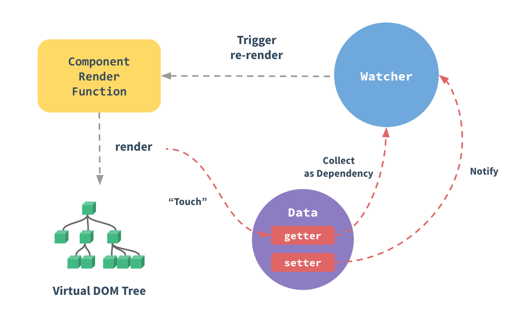

---

id:js1

title:响应式原理

---

## vue2中响应式

当你把一个普通的 JavaScript 对象传入 Vue 实例作为 data 选项，Vue 将遍历此对象所有的 property，并使用 `Object.defineProperty` 把这些 property
全部转为 `getter/setter`。



### 缺点

因为 defineProperty 需要明确知道对象上key的名称,`Object.defineProperty(obj, key,{})`,无法得知是否新增属性,所以在vue内部使用了`vue.$set`来给对象新增。
无法监听数组的变化,所以vue内部重写了`[
'push',
'pop',
'shift',
'unshift',
'splice',
'sort',
'reverse'
]`

```js
const obj = {
    name: '小明',
    age: 18
}

function Intercept(obj, key) {
    const key_ = obj[key]
    Object.defineProperty(obj, key, {
        get() {
            return key_  //因为不能返回原对象的getter 
        },
        set(value) {
            //observer观察者,可以拿到改变的值然后去做相应的操作
            observer(value)
        }
    })
}

Intercept(obj, 'name')

```

## vue3中响应式

vue3中响应式原理使用的是es6新语法 proxy, 在不支持的情况下也会使用 `Object.defineProperty`
两者具有相同的 Surface API，但是 Proxy 版本更精简，同时提升了性能。

```js
const dinner = {
    meal: 'tacos'
}

const handler = {
    get(target, prop) {
        track(target, prop)  //追踪也就是可以检测是否发生变化
        return Reflect.get(...arguments)  //Reflect 正确地执行 this 绑定 target[props]
    },
    set(target, key, value, receiver) {
        trigger(target, key) //
        return Reflect.set(...arguments)
    }
}
const proxy = new Proxy(dinner, handler)
console.log(proxy.meal)
proxy.meal = 'fish'

proxy.meal === dinner.meal //false  Proxy 的使用确实引入了一个需要注意的新警告：在身份比较方面，被代理对象与原始对象不相等

```
